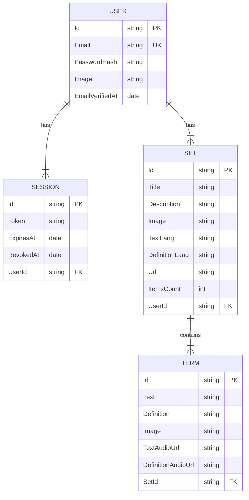

# Vocabify

## Entity-Related Diagram

```mermaid
erDiagram
  USER {
    Id string PK
    Email string UK
    PasswordHash string
    Image string
    EmailVerifiedAt date
  }

  SESSION {
    Id string PK
    Token string
    ExpiresAt date
    RevokedAt date
    UserId string FK
  }

  SET {
    Id string PK
    Title string
    Description string
    Image string
    TextLang string
    DefinitionLang string
    Url string
    ItemsCount int
    UserId string FK
  }

  TERM {
    Id string PK
    Text string
    Definition string
    Image string
    TextAudioUrl string
    DefinitionAudioUrl string
    SetId string FK
  }

  USER ||--|{ SET : has
  USER ||--|{ SESSION : has
  SET ||--|{ TERM : contains
```
