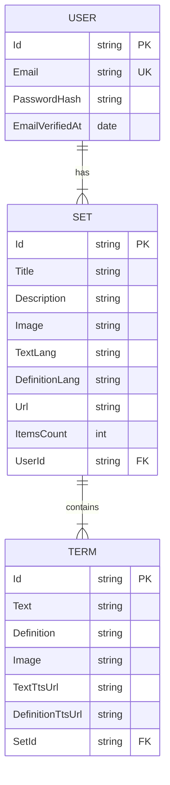

# Vocabify

## What is Vocabify?
A language learing project built using ASP.NET Web API, EntityFramework and Identity, React, SQLite and hosted using Docker.

### Implemented features
- Webpage parsing
- Quiz generation
- Data stores in the database
- Cookie based authentication and authorization
  
## Entity-Related Diagram

